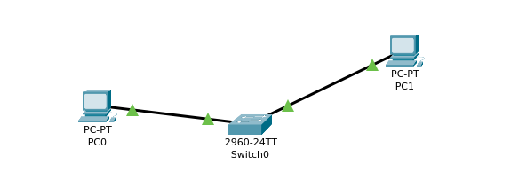

# Laboratório 05 — Comunicação Básica e Aprendizado de MAC

Laboratório prático desenvolvido no **Cisco Packet Tracer**, com o objetivo de demonstrar a comunicação entre dois computadores conectados a um switch e verificar o aprendizado de endereços MAC pelo dispositivo de camada 2.

## 🎯 Objetivo

Demonstrar uma comunicação básica entre dispositivos dentro da mesma rede local (LAN), utilizando um switch Cisco e endereçamento IPv4 estático.

Também foi realizada a verificação da tabela MAC do switch para confirmar o aprendizado dos endereços físicos dos computadores conectados.

## 🖥️ Topologia

A topologia é composta por:

- 1 Switch Cisco 2960-24TT
- 2 computadores (PC0 e PC1)

PC0 ─────── Switch0 ─────── PC1

🌐 Endereçamento IP

Dispositivo	Endereço IP	  Máscara	       Gateway
PC0	        192.168.1.10	255.255.255.0	 0.0.0.0
PC1	        192.168.1.20	255.255.255.0	 0.0.0.0

Os dois computadores pertencem à mesma rede:

192.168.1.0/24

Como a comunicação ocorre dentro da mesma rede local, não foi necessário utilizar um gateway.

🔌 Conexões:

Dispositivo	Porta do Switch
PC0	Fa0/1
PC1	Fa0/3

Ambas as portas permanecem na VLAN 1 (default).

🧪 Testes de Conectividade

Foram realizados testes de comunicação entre os computadores utilizando o comando ping.

PC0 → PC1
ping 192.168.1.20

Resultado:

Reply from 192.168.1.20

Comunicação realizada com sucesso.

PC1 → PC0
ping 192.168.1.10

Resultado:

Reply from 192.168.1.10

Comunicação realizada com sucesso.

🔎 Verificação da VLAN

Comando utilizado:

show vlan brief

Resultado relevante:

VLAN 1    default    active    Fa0/1, Fa0/2, Fa0/3, Fa0/4, ...

As portas utilizadas pelos computadores (Fa0/1 e Fa0/3) estão ativas na VLAN 1.

🧠 Aprendizado de Endereços MAC

Foi utilizado o comando:

show mac address-table dynamic

Resultado:

Vlan    Mac Address       Type        Ports

1       0002.16a6.e982    DYNAMIC     Fa0/1
1       0003.e427.3c71    DYNAMIC     Fa0/3

O resultado demonstra que o switch aprendeu dinamicamente os endereços MAC dos dois computadores e associou cada endereço à respectiva porta física.

✅ Resultado

O laboratório foi concluído com sucesso.

Foi possível verificar:

Comunicação entre dois hosts na mesma rede;
Configuração de endereçamento IPv4 estático;
Utilização da VLAN 1;
Funcionamento das portas de acesso do switch;
Aprendizado dinâmico de endereços MAC;
Conectividade confirmada através de ping.

🛠️ Tecnologias e Ferramentas:

Cisco Packet Tracer
Cisco Catalyst 2960
IPv4
Ethernet
VLAN
MAC Address Table
ICMP / Ping
