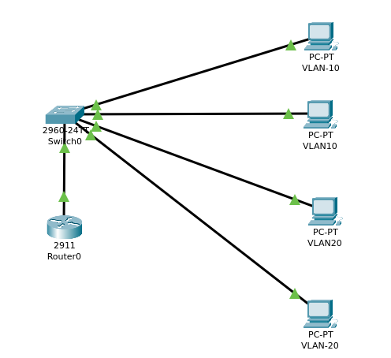

Laboratório 04 — Router-on-a-Stick

Implementação de roteamento entre VLANs utilizando a técnica Router-on-a-Stick no Cisco Packet Tracer.

Configurações realizadas:

- Criação das VLANs 10 e 20;
- Configuração das portas de acesso;
- Configuração de trunk 802.1Q entre switch e roteador;
- Criação das subinterfaces G0/0.10 e G0/0.20;
- Configuração dos gateways das VLANs;
- Testes de conectividade entre dispositivos de VLANs diferentes.

Endereçamento:

- VLAN: 10 
- Rede:192.168.10.0/24	
- Gateway: 192.168.10.1

- VLAN: 20 
- Rede: 192.168.20.0/24
- Gateway:192.168.20.1

Resultado:

Comunicação entre as VLANs validada com sucesso através de testes de ping.
