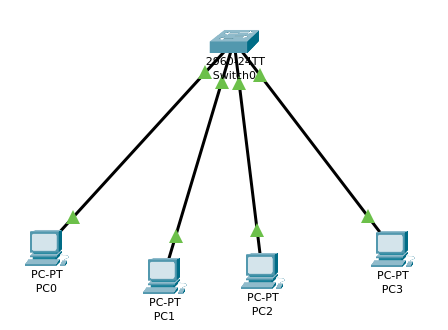

# Laboratório 03 — VLAN

## 🎯 Objetivo

Implementar e validar a segmentação lógica de uma rede utilizando VLANs
em um switch Cisco.

## 🖥️ Topologia

## 🌐 VLANs configuradas

| VLAN | Nome | Portas |
|---|---|---|
| 10 | VLAN10 | Fa0/1, Fa0/2 |
| 20 | VLAN20 | Fa0/3, Fa0/4 |

## 💻 Endereçamento

| Dispositivo | IP | VLAN |
|---|---|---|
| PC0 | 192.168.10.10/24 | 10 |
| PC1 | 192.168.10.11/24 | 10 |
| PC2 | 192.168.10.20/24 | 20 |
| PC3 | 192.168.10.21/24 | 20 |

## 🔌 Configuração das portas

As interfaces Fa0/1 a Fa0/4 foram configuradas
como portas de acesso (access ports).

- Fa0/1 → VLAN 10
- Fa0/2 → VLAN 10
- Fa0/3 → VLAN 20
- Fa0/4 → VLAN 20

## 🧪 Testes de conectividade

| Origem | Destino | Resultado |
|---|---|---|
| PC0 | PC1 | ✅ Sucesso |
| PC2 | PC3 | ✅ Sucesso |
| PC0 | PC2 | ❌ Falha |
| PC1 | PC3 | ❌ Falha |

## 🔎 Verificação da tabela MAC

O comando `show mac address-table dynamic`
confirmou que o switch aprendeu os dispositivos nas respectivas VLANs:

- VLAN 10 → Fa0/1 e Fa0/2
- VLAN 20 → Fa0/3 e Fa0/4

## 📚 Conceitos praticados

- VLAN
- Segmentação de rede
- Domínio de broadcast
- Portas de acesso
- Endereçamento IPv4
- Tabela MAC
- Comunicação intra-VLAN
- Isolamento entre VLANs
